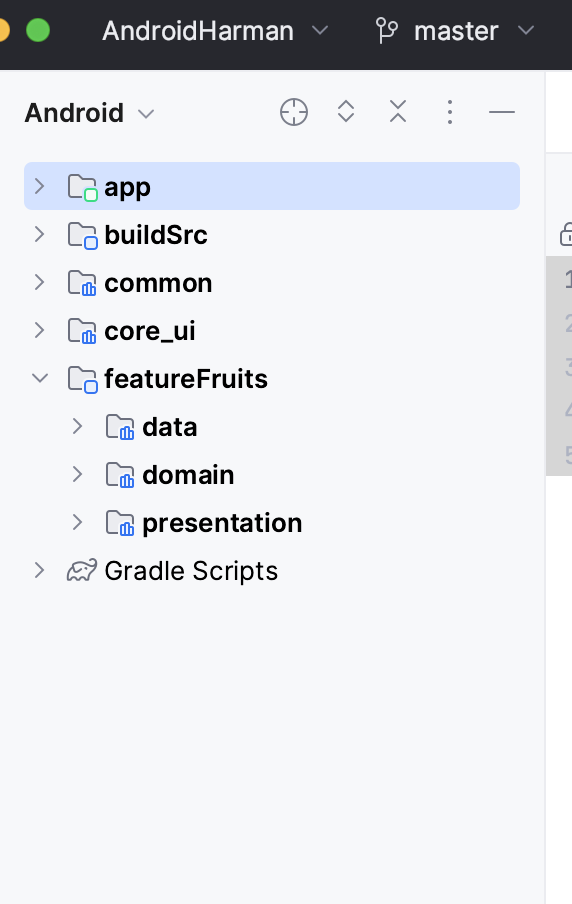

# Android Fruits Application

## Overview

The Android Fruits Application is a mobile app developed using Kotlin and Jetpack Compose. It
showcases a list of fruits, providing detailed views such as nutrition information for each fruit.
The app leverages modern Android development tools and practices, including dependency injection
with Dagger-Hilt and navigation with Jetpack Compose.

## Features

- **List of Fruits**: Displays a scrollable list of fruits.
- **Nutrition Details**: Offers detailed nutrition information for each fruit upon selection.
- **Modern UI**: Utilizes Jetpack Compose for a modern, declarative UI approach.
- **Dependency Injection**: Integrates Dagger-Hilt for efficient dependency management.
- **Navigation**: Implements navigation with Jetpack Compose Navigation.
- **Unit Testing**: Includes unit tests for the view models and repositories.

## Architecture

- **MVVM Architecture**: Follows the Model-View-ViewModel (MVVM) architecture for separation of
  concerns and easier testing.
- **Single Activity**: Uses a single activity architecture with multiple composables for different
  screens.
- **Clean Architecture**: Follows the Clean Architecture principles for better separation of
  concerns.

```
+-------------------+
|   Feature A       |
| +---------------+ |
| | Presentation  | |
| |     Layer     | |
| +---------------+ |
| |    Domain     | |
| |     Layer     | |
| +---------------+ |
| |     Data      | |
| |     Layer     | |
| +---------------+ |
+-------------------+
+-------------------+
|   Feature B       |
| +---------------+ |
| | Presentation  | |
| |     Layer     | |
| +---------------+ |
| |    Domain     | |
| |     Layer     | |
| +---------------+ |
| |     Data      | |
| |     Layer     | |
| +---------------+ |
+-------------------+
```

### FeatureFruits Module

The featureFruits module is structured to follow Clean Architecture principles, ensuring a clear
separation of concerns across different layers: Data, Domain, and Presentation.

#### Directory Structure

```
featureFruits/
├── data/
│   ├── di/
│   │   ├── NetworkModule.kt
│   │   ├── FruitsModule.kt
│   ├── repository/
│   │   ├── FruitsRepositoryImpl.kt
│   ├── remote/
│   │   ├── FruitsApi.kt
├── domain/
│   ├── repository/
│   │   ├── FruitsRepository.kt
│   ├── usecases/
│   │   ├── FruitsUseCase.kt
├── presentation/
│   ├── viewmodel/
│   │   ├── NutritionViewModel.kt
│   │   ├── FruitsViewModel.kt
│   ├── ui/
│   │   ├── FruitListScreen.kt
│   │   ├── HomeScreen.kt
│   │   ├── NutritionScreen.kt

```

### Supporting Modules

#### Common Module

The `common` module contains shared utilities and components that can be used across different
features of the application.

#### Core UI Module

The `core_ui` module contains shared UI components and dimens that can be used across different
features of the application.



---

## Static Code Analysis with Detekt

This project uses Detekt for static code analysis of Kotlin code.

### Configuration

The Detekt configuration file is located at `config/detekt/detekt.yml`. This file contains all the
rules and settings for Detekt.

### Running Detekt

To run Detekt, use the following Gradle command:

```sh
./gradlew detekt
```

## Getting Started

To run the project, clone the repository and open it in Android Studio Hedgehog | 2023.1.1 Patch 2
or later.

### Prerequisites

- Android Studio Hedgehog | 2023.1.1 Patch 2
- JDK 11 or newer

### Installation

1. Clone the repository
2. Open the project in Android Studio
3. Build and run the project
4. Explore the app
